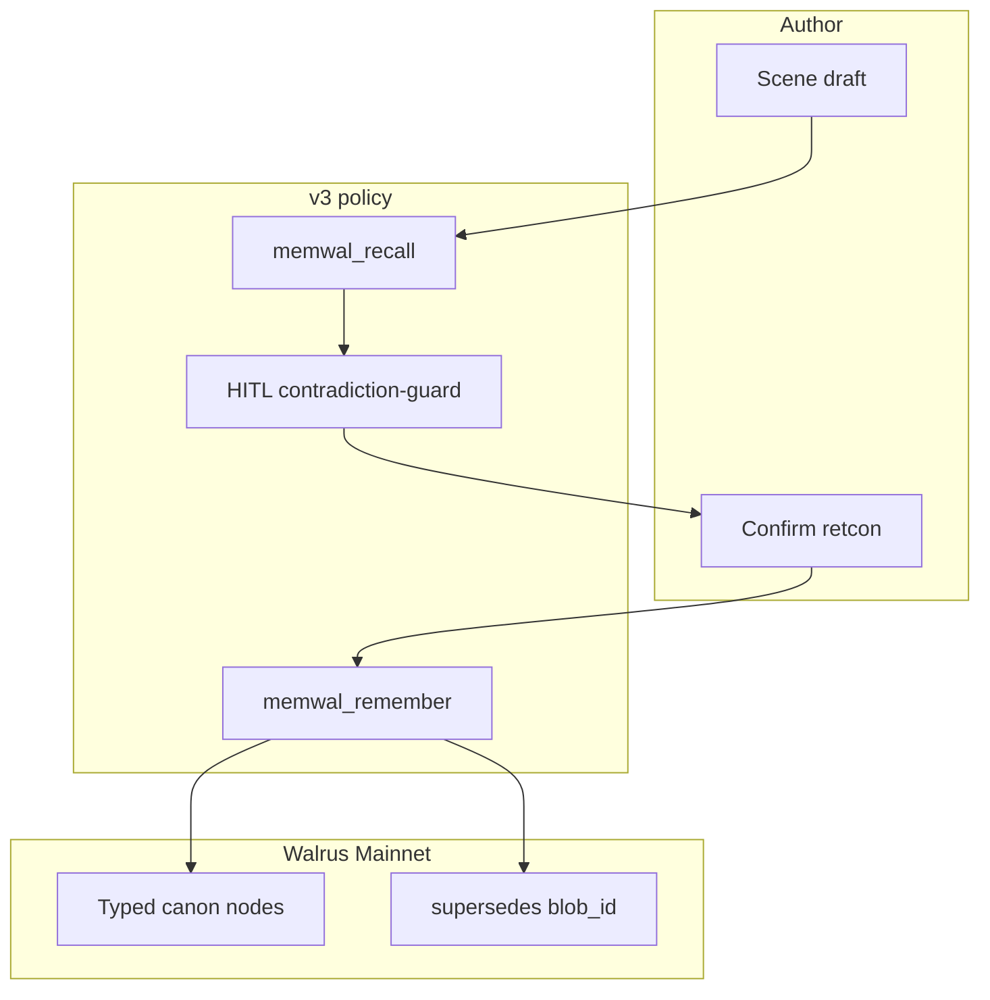

# 🧬 EvoPrompt 26

### *Harness & Graph-Native Lore Engine*

**Walrus Sessions 7 · Prompt Evolution · Continuity Keeper v3**

  


[Walrus_Sessions](https://www.walrus.xyz/)
[Track](https://github.com/yukitran03/continuity-keeper)
[Mainnet](https://walruscan.com/mainnet)

  


[Prompt_v3](prompt/FINAL_continuity-keeper.md)
[Judge_pack](docs/COMPETITIVE_ANALYSIS.md)
[DeepSurge_draft](docs/submission-DRAFT.md)
[Upstream](https://github.com/yukitran03/continuity-keeper)
[GitHub](https://github.com/Olympusxvn/session7-continuity)

  


[Node.js](https://nodejs.org/)
[MemWal](https://github.com/MystenLabs/MemWal)
[Cursor](https://cursor.com/)
[Namespace](STORY.md)

  


> A software engineer’s rewrite of a fiction bible prompt: **typed canon as a state graph**, human-gated supersede, official Walrus Memory only. No invented delete API.

  


```
recall → HITL contradiction-guard → remember
              │
              └── supersedes: <blob_id>   neighbors stay
                  one namespace · harness = platform
```


---

## 📑 Contents


|     |                                                |
| --- | ---------------------------------------------- |
| ⚖️  | [For judges](#-for-judges--5-min-verify)       |
| 🎯  | [Which prompt and why](#-which-prompt-and-why) |
| 🔁  | [Before / after](#-before--after)              |
| 🏗️ | [Overview](#-overview)                         |
| ⛓️  | [On-chain proof](#-on-chain-proof)             |
| 🧪  | [Friction + one idea](#-friction--one-idea)    |
| ⚡   | [Quick start](#-quick-start)                   |
| 📚  | [Documentation](#-documentation)               |
| 🔒  | [Security](#-security)                         |


---


## ⚖️ For judges — 5 min verify

**No secrets. No wallet required to read the prompt and the evidence.**  
Contest floor is **≥10 Mainnet blobs**. This run: **30 unique `blob_id`s** (Days 1–5). Overnight Day 5 recall still current. Inkray URL after you publish.


| 🔗 Resource                     | 📍 Link                                                                                                                                                                                 |
| ------------------------------- | --------------------------------------------------------------------------------------------------------------------------------------------------------------------------------------- |
| **📜 Full prompt (copy-paste)** | `[prompt/FINAL_continuity-keeper.md](prompt/FINAL_continuity-keeper.md)`                                                                                                                |
| **📝 DeepSurge draft (§1–§4)**  | `[docs/submission-DRAFT.md](docs/submission-DRAFT.md)`                                                                                                                                  |
| **⚖️ Eval matrix**              | `[docs/COMPETITIVE_ANALYSIS.md](docs/COMPETITIVE_ANALYSIS.md)`                                                                                                                          |
| **📖 Lived diary**              | `[logs/diary.md](logs/diary.md)`                                                                                                                                                        |
| **🧮 Blob log**                 | `[logs/blob-log.md](logs/blob-log.md)`                                                                                                                                                  |
| **🎬 Scenes**                   | `[logs/scenes/](logs/scenes/)`                                                                                                                                                          |
| **📰 Article 10**               | `[docs/ARTICLE_10.md](docs/ARTICLE_10.md)`                                                                                                                                              |
| **🐛 MemWal issues**            | [#591](https://github.com/MystenLabs/MemWal/issues/591) · [#592](https://github.com/MystenLabs/MemWal/issues/592) · PR [#605](https://github.com/MystenLabs/MemWal/pull/605) (**OPEN**) |


```bash
# Author-only (this dedicated Sessions wallet). Judges: use the table above.
node vendor/continuity-keeper/tools/continuity/cli.mjs count
node vendor/continuity-keeper/tools/continuity/cli.mjs recall --ns session7-continuity \
  --query "Minh Dry Dock Lan Tide Signal" --k 8 --json
```

**What the prompt solves (2–5 sentences):** Original Continuity Keeper stores a story bible on Walrus Memory but **namespace-forgets a whole character** to change one fact, and pushes authors into a CLI. v3 keeps recall-first / contradiction-guard / cosine dedup, then models canon as **nodes + supersede edges** on **one** namespace. Retcon is HITL in chat (`preview` → confirm → `memwal_remember`). Job waits, token budgets, and permanent blob delete stay on the **platform** — this prompt does not invent `memwal_delete` or a 15s index cache.

---

## 🎯 Which prompt and why

Base: **[continuity-keeper](https://github.com/yukitran03/continuity-keeper)** (Session 5) — a system prompt that already tells an agent to store and recall a **story bible** on Walrus Memory.

Why this one, not a setup snippet and not a generic assistant:


| Choice                      | Reason                                                                                                       |
| --------------------------- | ------------------------------------------------------------------------------------------------------------ |
| **Fiction + durable state** | A plot twist is a **write** to current canon. That is the hardest honest use of `remember` / `recall`.       |
| **Known failure mode**      | Their own CLI `supersede` = `POST /api/forget` on `{story}::char::{slug}`. One beat wipes the character.     |
| **Engineer-shaped gap**     | Bring **data-structure** thinking (typed nodes, edges, approval) to a novelist’s loop — without faking APIs. |


`memwal_assistant` (my prior line) is the wrong product here: strong for systems memory, **weak as a lore engine**. We say that in the [matrix](docs/COMPETITIVE_ANALYSIS.md). Continuity Keeper was the prompt worth evolving.

**Repo folder:** `session7-continuity` · **Display name:** EvoPrompt 26 (Harness & Graph-Native Lore Engine).

---

## 🔁 Before / after

Lived on one dedicated Mainnet account. Phase A = **their** prompt + CLI. Phase B = **v3**.


|                | **Before — original CK (Days 1–3)**                                           | **After — v3 (Day 4+)**                                                    |
| -------------- | ----------------------------------------------------------------------------- | -------------------------------------------------------------------------- |
| **Storage**    | Per-entity ns `ca_voi_con::char::minh` …                                      | One ns `session7-continuity`                                               |
| **Retcon**     | Leave chat → `continuity supersede` → rewrite facts file                      | Stay in chat: preview obsolete node → `remember` + `supersedes: <blob_id>` |
| **Clock**      | **~8–10 min**, **two HTTP 429** (`30 weighted-requests/min`)                  | Day 4 HITL in the same thread (MCP `remember`; bulk poll still timed out)  |
| **Amnesia**    | Minh recall **0 hits** (`dropped_count: 2`); hoodie rebuilt from local ledger | Neighbors stay unless the author retires that node                         |
| **Proof beat** | Ch.2: fake Tide Signal → public liquidation → backup wallet                   | Ch.3: Minh leaves Booth 7 → **Dry Dock**; refused North Pier               |


**Day 4 HITL (inline, no CLI forget):**


|                                                | `blob_id`                                     |
| ---------------------------------------------- | --------------------------------------------- |
| Obsolete (Ch.2 allegiance)                     | `CDx1J2d5JkfczqjT2tioW52GlyYEwERQljHyTU4AWWU` |
| Current (Dry Dock / no Oracle / no North Pier) | `kyYS4X5wpxiVmp9Zn858NrfNedu7hegKJqm_WnXFRvU` |


↻ superseded: Harbor Node Booth 7 regular  
✓ canon: Dry Dock · shared recall of Minh + place + Lan + Tide Signal

**What we did *not* ship:** surgical ID purge in the prompt · `SIGNAL_MUTATION` intercept · 15s exclusion cache · “PR #605 merged.” v1 almost walked that path. Eval killed it. Changelog: [v1](docs/changelog/PROMPT-v1-context-engineering.md) · [v2](docs/changelog/PROMPT-v2-harness-contract.md).

---

## 🏗️ Overview

Prompt-as-code for 2026: the model owns **continuity policy**; the SDK/MCP owns **budgets, job waits, retries**. Graph language is the **canon model** (nodes / edges / HITL), not a dashboard runtime.


| Layer                               | Responsibility                                                                |
| ----------------------------------- | ----------------------------------------------------------------------------- |
| **🖥️ Author**                      | Draft scenes. Confirm retcon. Never paste seeds.                              |
| **📜 Prompt v3**                    | Recall-first · contradiction-guard · durable `[canon:]` only · HITL supersede |
| **🤖 Cursor + MCP**                 | Official `@mysten-incubation/memwal-mcp` · ns `session7-continuity`           |
| **🛠️ CLI (Phase A / diagnostics)** | `rememberAndWait` · `count` · `export` — **not** normal Phase B supersede     |
| **⛓️ Walrus Memory**                | Encrypted Mainnet blobs · dashboard / signed API for permanent delete         |





**Three pillars (how this repo was actually run):**


| Pillar                | In this project                                                                                                                                  |
| --------------------- | ------------------------------------------------------------------------------------------------------------------------------------------------ |
| **1. Evolutionary**   | Human operator: namespace-wipe pain → mutate prompt **v1 → v2 → v3**. The surgical-delete mutation **failed eval** and was dropped.              |
| **2. Eval-driven**    | [Technical matrix](docs/COMPETITIVE_ANALYSIS.md) scored on live 429s, `dropped_count`, #591 probe, Day 4 unified recall — not adjective quality. |
| **3. Prompt-as-code** | `prompt/*.md` · `.cursor/rules/continuity-keeper.mdc` · `.cursor/mcp.json` · git history of the bible, not a paste box.                          |


---

## ⛓️ On-chain proof

Dedicated Sessions wallet. All story memory on **Walrus Mainnet**.


| Field                                  | Value                                                                |
| -------------------------------------- | -------------------------------------------------------------------- |
| **MemWal account**                     | `0xd7ec125eb467c0cce65b219ff7ddeea217c16709077c2c48c183e47e80704287` |
| **Delegate public key**                | `e69bc719e01d0582d7ff75a7e962a1f9a740a28ab76a4b4bb3aa63761ac8ff59`   |
| **Relayer**                            | `https://relayer.memory.walrus.xyz`                                  |
| **Story slug**                         | `ca_voi_con` (crypto noir)                                           |
| **Phase A namespaces**                 | `ca_voi_con::char::minh` … (locked until Day 3 CLI)                  |
| **Phase B namespace**                  | `session7-continuity`                                                |
| **Unique `blob_id`s (ledger `count`)** | **30** (29 story + forgotten #591 probe blob)                        |
| **Contest floor**                      | ≥10 · target ~21 · **cleared**                                       |


| Day | Focus                                                    | ~new blobs |
| --- | -------------------------------------------------------- | ---------- |
| 1   | Seed bible (CLI; MCP tools often missing from the agent) | 7          |
| 2   | Ch.1 Harbor Node; cosine skip ×3                         | 6          |
| 3   | CLI supersede + twist                                    | 10         |
| 4   | v3 HITL + unified ns                                     | 6          |
| 5   | Proof pack / overnight recall                            | 0 (timeout) |


Sample explorer: [Dry Dock HITL blob](https://walruscan.com/mainnet/blob/kyYS4X5wpxiVmp9Zn858NrfNedu7hegKJqm_WnXFRvU)

---

## 🧪 Friction + one idea

**Friction (measured):** Official MCP can show **green** in Settings while this agent chat has **no** `memwal_*` tools. Days 1–3 writes used the Continuity CLI (same credentials). Day 3 `supersede` hit **429** (`retry_after_seconds: 60`) twice. Day 4 `remember_bulk` saved **2/6** (poll timeout 120s); singles then returned `blob_id`s. MCP still has **no** `waitForRememberJob` on the tool surface.

**We were wrong, then we measured:** forget does **not** leak stale vectors for 15s on the same namespace. Probe: `forget` `deleted:1` → immediate `recall` `total:0`. Write-up: [comment on #591](https://github.com/MystenLabs/MemWal/issues/591#issuecomment-5291423797).

**One improvement for Walrus Memory:** expose **job wait / status on MCP `remember`**, and `maxTokens` on MCP `recall` (SDK PR [#605](https://github.com/MystenLabs/MemWal/pull/605) is **open**, not merged). Optional later: entry-level retire so authors never need namespace `forget` for one plot beat.

**Issues filed (MemWal, not prompt theater):** [#591](https://github.com/MystenLabs/MemWal/issues/591) · [#592](https://github.com/MystenLabs/MemWal/issues/592).

---

## ⚡ Quick start

```bash
# 0) Dedicated Sessions wallet → ~/.memwal/credentials.json (never commit)
npx -y @mysten-incubation/memwal-mcp login

# 1) Helper CLI (Phase A + diagnostics)
node vendor/continuity-keeper/tools/continuity/cli.mjs health
# or: ./continuity.sh health

# 2) Cursor: Settings → MCP → memwal green
#    Project rule: .cursor/rules/continuity-keeper.mdc  (Phase B = v3)
#    Namespace env: session7-continuity
```


| Who                  | What to open                                                                                                                                            |
| -------------------- | ------------------------------------------------------------------------------------------------------------------------------------------------------- |
| **Judge**            | `[prompt/FINAL_continuity-keeper.md](prompt/FINAL_continuity-keeper.md)` then `[docs/COMPETITIVE_ANALYSIS.md](docs/COMPETITIVE_ANALYSIS.md)`            |
| **Author, Days 1–3** | Original prompt `[prompt/PHASE_A_continuity-keeper.md](prompt/PHASE_A_continuity-keeper.md)` + CLI supersede — **do not** switch ns until Day 3 is done |
| **Author, Days 4+**  | v3 + unified ns · story notes `[STORY.md](STORY.md)`                                                                                                    |


---

## 📚 Documentation


| 📄 Document                                                                                          | 🎯 Purpose                                          |
| ---------------------------------------------------------------------------------------------------- | --------------------------------------------------- |
| `[prompt/FINAL_continuity-keeper.md](prompt/FINAL_continuity-keeper.md)`                             | **Submission prompt (v3)**                          |
| `[prompt/PHASE_A_continuity-keeper.md](prompt/PHASE_A_continuity-keeper.md)`                         | Original CK (Days 1–3)                              |
| `[prompt/PHASE_B_continuity-keeper.md](prompt/PHASE_B_continuity-keeper.md)`                         | Same text as FINAL                                  |
| `[docs/COMPETITIVE_ANALYSIS.md](docs/COMPETITIVE_ANALYSIS.md)`                                       | Quantitative matrix + killed mutations              |
| `[docs/ARTICLE_10.md](docs/ARTICLE_10.md)`                                                           | Inkray Article 10 (architectural audit)             |
| `[docs/DAY5_PROOF.md](docs/DAY5_PROOF.md)`                                                           | DeepSurge collect + §3/§4 paste                     |
| `[docs/submission-DRAFT.md](docs/submission-DRAFT.md)`                                               | DeepSurge §1–§4 draft                               |
| `[docs/HARNESS-CONTRACT.md](docs/HARNESS-CONTRACT.md)`                                               | Platform vs prompt (next rung, not a local wrapper) |
| `[docs/ISSUES-591-592.md](docs/ISSUES-591-592.md)`                                                   | Team replies + PR #605 status                       |
| `[docs/changelog/PROMPT-v1-context-engineering.md](docs/changelog/PROMPT-v1-context-engineering.md)` | Retired v1                                          |
| `[docs/changelog/PROMPT-v2-harness-contract.md](docs/changelog/PROMPT-v2-harness-contract.md)`       | Retired v2                                          |
| `[STORY.md](STORY.md)`                                                                               | `ca_voi_con` bible notes                            |
| `[DAY0_CHECKLIST.md](DAY0_CHECKLIST.md)`                                                             | Setup status                                        |
| `[logs/diary.md](logs/diary.md)`                                                                     | Smooth / friction / ideas                           |
| `[logs/blob-log.md](logs/blob-log.md)`                                                               | Daily blob estimate                                 |


**🔗 References**


| Resource                                 | URL                                                                                                                              |
| ---------------------------------------- | -------------------------------------------------------------------------------------------------------------------------------- |
| Continuity Keeper (Session 5)            | [https://github.com/yukitran03/continuity-keeper](https://github.com/yukitran03/continuity-keeper)                               |
| MystenLabs / MemWal                      | [https://github.com/MystenLabs/MemWal](https://github.com/MystenLabs/MemWal)                                                     |
| Issue #591 (stale recall / await write)  | [https://github.com/MystenLabs/MemWal/issues/591](https://github.com/MystenLabs/MemWal/issues/591)                               |
| Issue #592 (token budget)                | [https://github.com/MystenLabs/MemWal/issues/592](https://github.com/MystenLabs/MemWal/issues/592)                               |
| PR #605 (`maxTokens`, **OPEN**)          | [https://github.com/MystenLabs/MemWal/pull/605](https://github.com/MystenLabs/MemWal/pull/605)                                   |
| Walrus Memory docs                       | [https://docs.wal.app/walrus-memory/getting-started/quick-start](https://docs.wal.app/walrus-memory/getting-started/quick-start) |
| Delete memories (dashboard / signed API) | [https://docs.wal.app/walrus-memory/guides/delete-old-memories](https://docs.wal.app/walrus-memory/guides/delete-old-memories)   |
| Relayer                                  | [https://relayer.memory.walrus.xyz](https://relayer.memory.walrus.xyz)                                                           |
| Walruscan                                | [https://walruscan.com/mainnet](https://walruscan.com/mainnet)                                                                   |


---

## ✅ Checklist (contest)


| Requirement                                              | This repo                                                                                                                              |
| -------------------------------------------------------- | -------------------------------------------------------------------------------------------------------------------------------------- |
| Evolution of a Prompt Jam prompt that uses Walrus Memory | Yes — Continuity Keeper                                                                                                                |
| Full copy-pasteable prompt                               | `[prompt/FINAL_continuity-keeper.md](prompt/FINAL_continuity-keeper.md)`                                                               |
| Before/after + why                                       | This README + [matrix](docs/COMPETITIVE_ANALYSIS.md) + [form draft](docs/submission-DRAFT.md)                                          |
| Evidence of use                                          | `[logs/](logs/)` · 30 Mainnet blobs · Day 4 `blob_id`s above                                                                           |
| ≥10 blobs · agent ID on the form                         | Account `0xd7ec…4287` · count **30**                                                                                                   |
| Dedicated Sessions wallet                                | Day 0 logged; credentials **not** in git                                                                                               |
| 1 friction + 1 improvement                               | [§ Friction](#-friction--one-idea)                                                                                                     |
| Issue on MemWal                                          | #591 · #592                                                                                                                            |
| Issue on **original prompt** GitHub                      | Still open for Day 5 (file on [yukitran03/continuity-keeper](https://github.com/yukitran03/continuity-keeper) if the form requires it) |
| Blog                                                     | [docs/ARTICLE_10.md](docs/ARTICLE_10.md) · pack [DAY5_PROOF.md](docs/DAY5_PROOF.md) — Inkray URL after publish                         |


---

## 🔒 Security

- Never commit `~/.memwal/credentials.json`, `.cursor/mcp.json`, `.env`, or seed phrases.
- Tide Ledger canon stores **object state** (opened / in jacket), not the backup words.
- Permanent blob removal: [Walrus dashboard](https://docs.wal.app/walrus-memory/guides/delete-old-memories) or wallet-signed Security Delete API — **not** a prompt-invented `memwal_delete`.
- Do not namespace-wipe to fix one fact.

---


**EvoPrompt 26**

*Harness & Graph-Native Lore Engine — Continuity Keeper v3 for Walrus Sessions 7*

Evolved from [continuity-keeper](https://github.com/yukitran03/continuity-keeper) · memory on Walrus Mainnet · harness left to the platform

